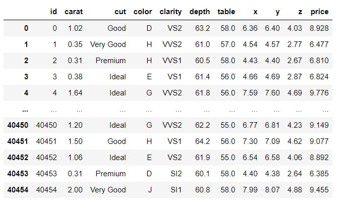
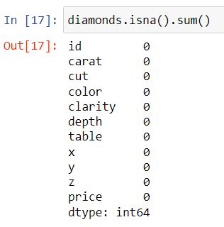
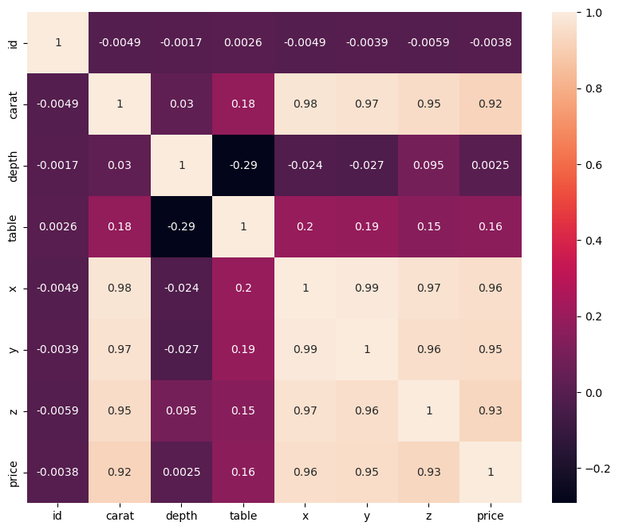
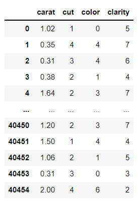
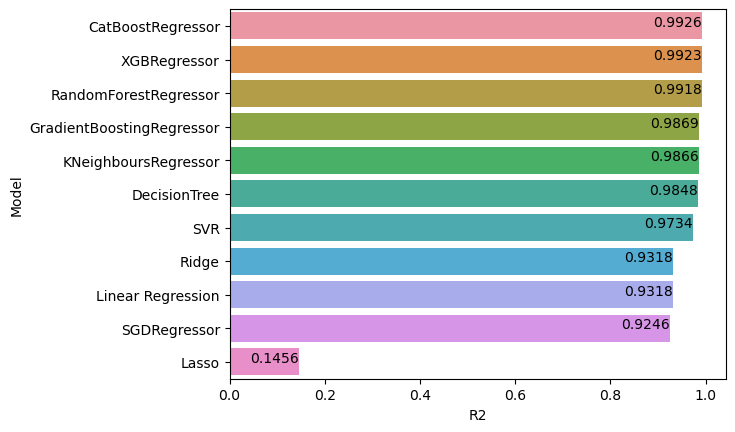
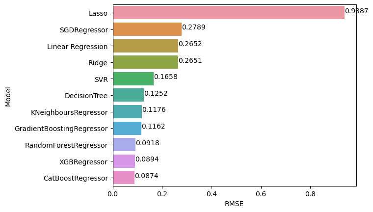
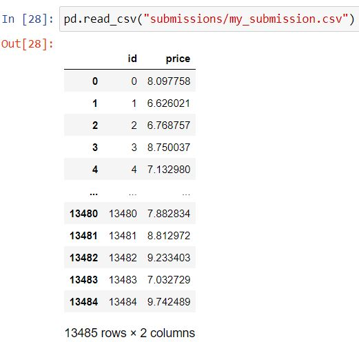
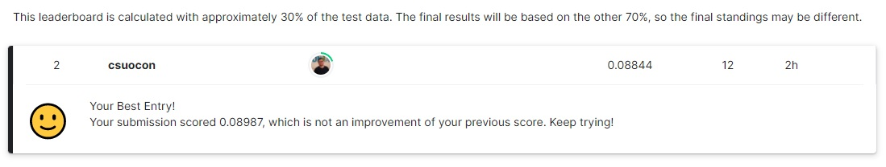
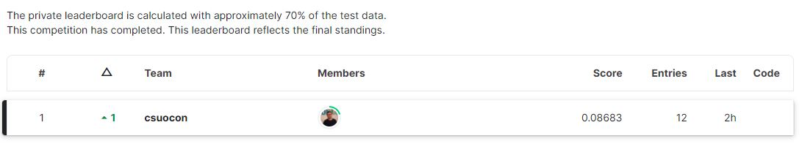

# Predicting diamond prices using machine learning

Precious stones like diamond are in high demand in the investment market due to their monetary rewards. Thus, it is of utmost importance to the diamond dealers to predict the accurate price.
However, the prediction process is difficult due to the wide variation in the diamond stones sizes and characteristics. In this work, several machine learning models were used to help in predicting diamond price, among them Linear regression, Random forest regression, or boost regression. After training several models, testing their accuracy and analyzing their results, the best of them turns out to be catboost regression with an accuracy of 99.25%.


## 1. Objective

Win the Kaggle competition available on https://www.kaggle.com/competitions/databcn1022/overview

## 2. Datasets

Two datasets were available for this project:

1. **train.csv:** a complete dataset including information about carat, depth, table, cut, color and dimensions of 40455 diamonds. It is used to inspect and transform the data to train the Regression model. It is already the 80% of the complete dataset.
2. **test.csv:** it contains the 20% of the remaining data. It will be used to make the predictions using the model trained from train.csv. It also has the same cleaning steps as the previous file.

## 3. Repo contents

**Root**

**1-findbestmodel.py:** it performs a series of cleaning tasks, such removing unnecessary columns and label encodoing some values. It also splits train.csv dataset in 80% training and 20% testing. The 80% is trained with several models:

- Linear Regression
- Ridge
- Lasso
- SGD Regressor
- K Neighbors Regressor
- Gradient Boosting Regressor
- SVR
- Random Forest Regressor
- Decision Tree Regressor
- Cat Boost Regressor
- XGB Regressor

It returns the metric error MAE, MSE, RMSE, R^2. It helps choose the model with the less error and highest R^2 values.

**2-findbestconditions.py:** it takes the best model from the previous file (CatBoostRegressor) and fine-tunes its performance by re-splitting the file 80%-20%. The best performance is analyzed by GridSearchCV: it iterates the model according the given parameters.
It returns the hyperparameters with the best conditions.

**3-savemymodel.py:** the train.csv is full taken (no split this time) and trained according the best parameters found in findbestconditions.py. Then, the model is saved thanks to the Pickle library.

**4-cleantest.py:** the test.csv file is cleaned according the steps made in train.csv. It returns the file testclean.csv

**5-sampleforsubmission.py:** loads the file testclean.csv and the best model. The model makes the price prediction according to testclean.csv. It returns the csv with only ID and predicted price, ready for submission.

<br>

**Data/**

Contains all the datasets and the returning .csv files

**Images/**

Images to complement the readme file

**Models/**

Contains the model file

**Submissions/**

Contains the csv file ready for submission

## 4. Exploratory analysis

This is how train.csv looks like:



We can see there are some columns with integer or float values and some others object-like.

The next step was to identify the possible missing values, but none were found:



With the confidence of having a clean dataset, it was time to understand all the columns.

According to **Mihir et al.** (**DOI: 10.1109/C2I454156.2021.9689412**), the features that define a diamond are clarity, weight, cut, width, length, depth and color. However, the most crucial factors or main features are cut, clarity, color, and weight (carat), which are also known as the 4C.

In order to confirm this theory, it was necessary to calculate the Pearson correlation coefficient between all the variables. By plotting the result in a heatmap, one could easily see the relation between all the parameters. Please take into account that "cut" and "clarity" can not be computed because the values are strings.



Interestingly, in this case it seems that width (x), length (y) and depth (z) have strong correlation with price, along with carat.

**Therefore, I would not consider removing x, y, z columns from the dataset, but only depth, table and id.**

However, there is a strong possibility that the outliers could affect the model predictions, as shown in the following boxplot:


### 4.1. Label encoding

Label encoding is necessary to transform categorical data into numerical data. In this case, I had to convert "cut", "clarity" and "color" columns.

**"Cut"** contains the following variables: Fair, Good, Very Good, Ideal and Premium.

**"Color"** contains the following variables: D, E, F, G, H, I, J (D is the best, J the worst).

**"Clarity"** contians the following variables: VS2, VVS2, VVS1, VS1, SI1, SI2, I1, IF (IF is the best, I1 is the worst).

**Label encoding** was performed by importing preprocessing module from sklearn:

```python
from sklearn import preprocessing
le = preprocessing.LabelEncoder()
```

This is the final result:



## 5. Choosing the model

The result of the training (80% train.csv) with all the models mentioned before are shown below:

| Model | MAE | MSE | RMSE | R^2 |
| --- | --- | --- | --- | --- |
| Linear Regression | 0.165507393905612 | 0.07034162220479187 | 0.2652199506160724 | 0.9317927245176196 |
| Ridge | 0.1655342955712319 | 0.0702964277058521 | 0.2651347350043975 | 0.9318365476985877 |
| Lasso | 0.8106135147775033 | 0.8811260003841934 | 0.9386831203255939 | 0.1456096410753719 |
| SGDRegressor | 0.16444885355350836 | 0.07776117036047768 | 0.2788568994313709 | 0.9245983046400641 |
| KNeighborsRegressor | 0.08040931899641576 | 0.013834599268322822 | 0.11762057332083882 | 0.9865851782500041 |
| GradientBoostingRegressor | 0.08964416099097926 | 0.013495243238402963 | 0.1161690287400345 | 0.9869142373403954 |
| SVR | 0.11930655335582263 | 0.027476078496935057 | 0.16575909778028794 | 0.9733576167783021 |
| RandomForestRegressor | 0.0655283501220247 | 0.008429816436485214 | 0.09181403180606554 | 0.9918259659938569 |
| DecisionTree | 0.08628024966011617 | 0.01567811911383018 | 0.12521229617665422 | 0.9847975955639854 |
| **CatBoostRegressor** | **0.06359050568687474** | **0.0076441673537018025** | **0.08743092904517144** | **0.9925877764517658** |
| XGBRegressor | 0.06406989942264711 | 0.00798898754415812 | 0.08938113640001519 | 0.9922534189975991 |

R^2 comparison:


RMSE comparison:


## 6. Tuning the model

The best **CatBoostRegressor** hyperparameters were found with OpenGridCSV:

```python
grid = GridSearchCV(estimator=model_CBR, cv=3, param_grid = parameters, n_jobs=-1)
```


| Best score across all searched params |
| --- |
| 0.992573219163065 |

| Hyperparameter | Best value |
| --- | --- |
| loss_function | RMSE |
| bagging_temperature | 0 |
| depth | 6 |
| iterations | 1100 |
| l2_leaf_reg | 0.25 |
| learning_rate | 0.1 |
| random_strength | 10 |
| border_count | 128 |
| grow_policy | SymmetricTree |

After an iteration that took 10 hours, the best prediction so far was the following:

| Model | MAE | MSE | RMSE | R^2 |
| --- | --- | --- | --- | --- |
| CatBoostRegressor (tuned) | 0.0617569806808425 | 0.007352739569756394 | 0.08574811700414414 | 0.9929259938024839 |


## 7. Submission sample

This is the final csv file:



## 8. Kaggle leaderboard

This was my position in the public ranking (calulated with approximately 30% of the data)



In this was the FINAL score in the private leaderboard, only available after the deadline:




<br>
<br>
Fun fact: did you know that diamonds are not as indestructible as commonly thought?


## 9. Links and resources

- https://ieeexplore-ieee-org/document/9689412/
- https://catboost.ai/en/docs/installation/python-installation-test-catboost
- https://catboost.ai/en/docs/references/training-parameters/
- https://catboost.ai/en/docs/concepts/parameter-tuning#overfitting-detection-settings
- https://www.projectpro.io/recipes/find-optimal-parameters-for-catboost-using-gridsearchcv-for-regression
- https://towardsdatascience.com/catboost-regression-in-6-minutes-3487f3e5b329
- https://www.kaggle.com/code/tobby1177/diamond-price-modelling/notebook

